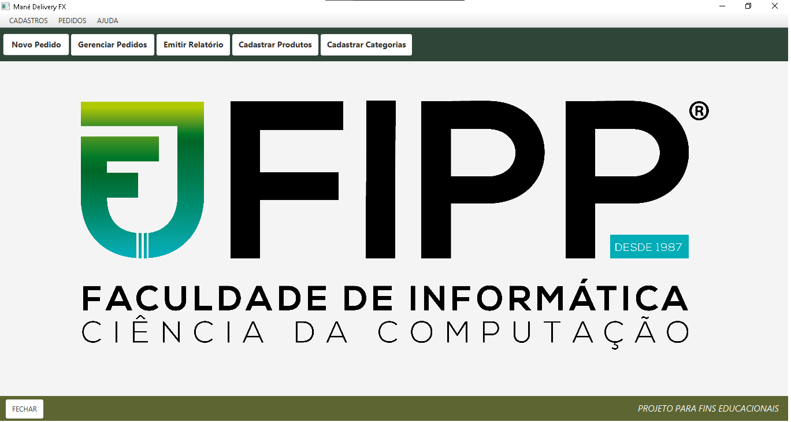
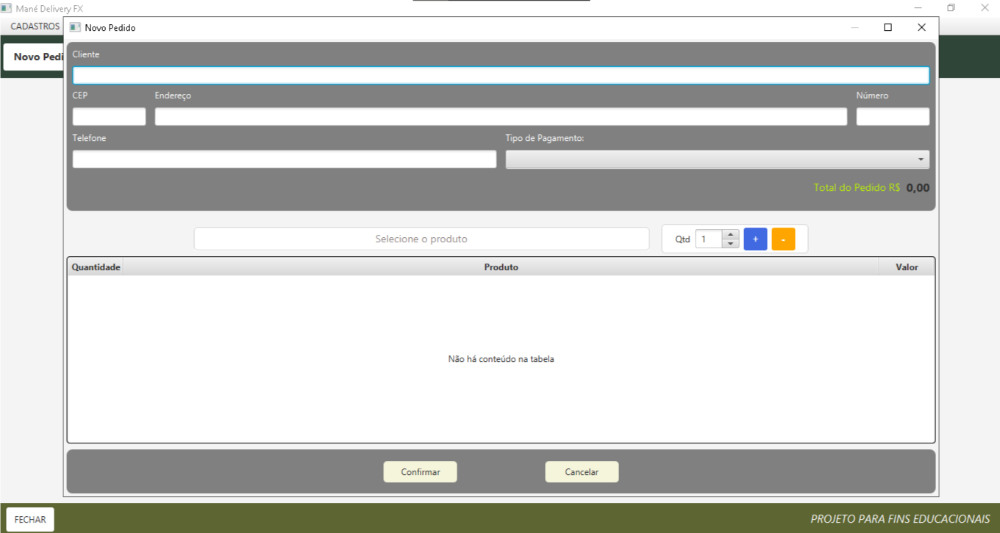
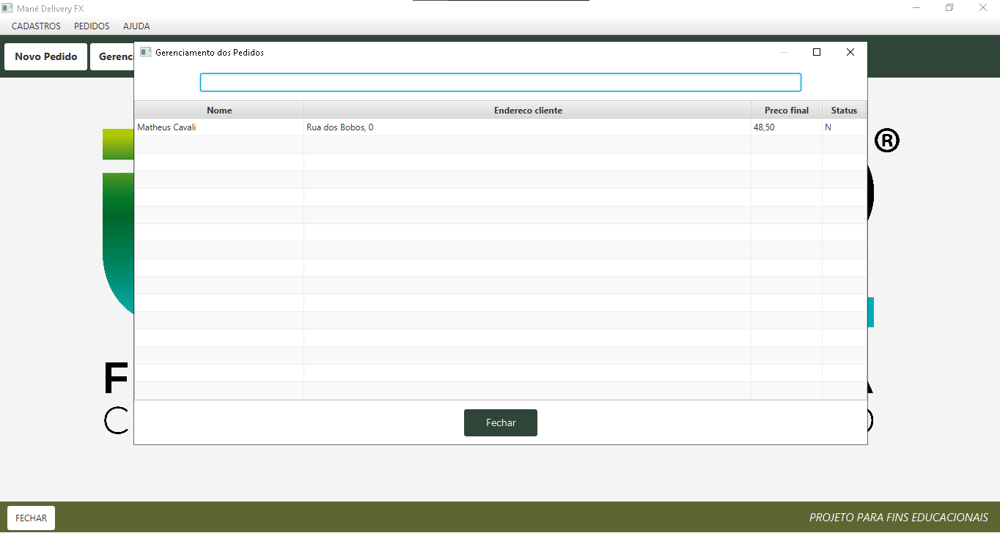
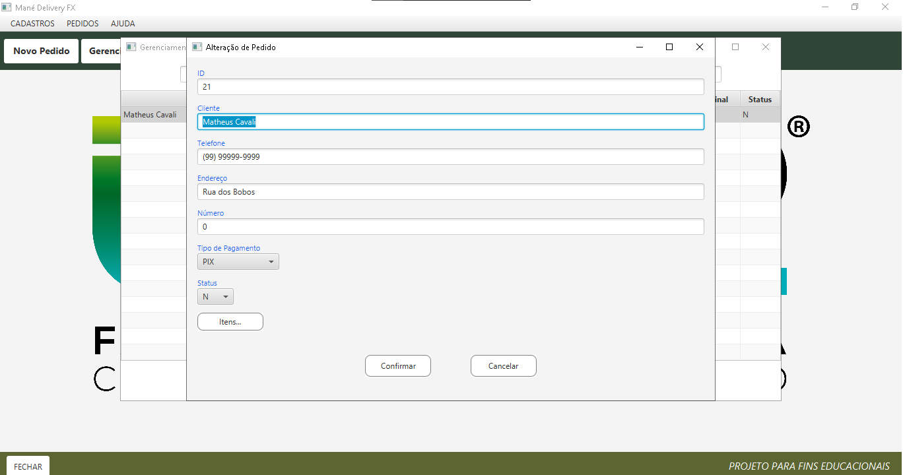
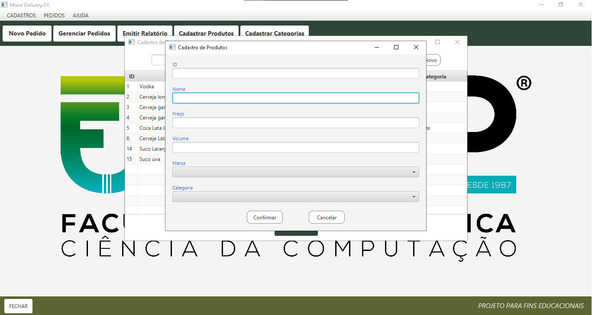
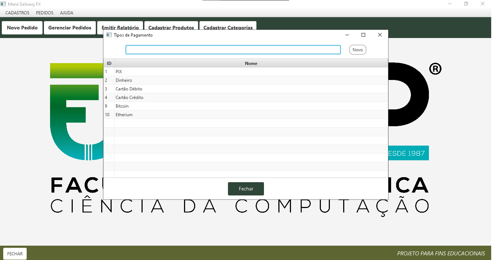
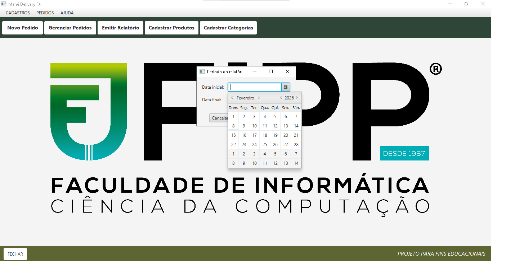

Sistema de Gestão de Pedidos

Telas do Sistema
### Tela Principal

### Novo Pedido

### Gerenciamento de Pedidos

### Alteração de Pedidos

### Cadastro de Produtos

### Tipos de Pagamentos

### Emissão Relatorio

Projeto acadêmico desenvolvido no curso de **Sistemas de Informação**, com o objetivo de aplicar conceitos fundamentais de programação, como lógica, estrutura de dados e banco de dados, em um sistema desktop.

Descrição:
O Sistema de Gestão de Pedidos é uma aplicação desktop desenvolvida em Java que permite o cadastro de produtos e categorias, o gerenciamento de pedidos e a emissão de relatórios, simulando um sistema simples utilizado em ambientes comerciais.

O projeto foi criado com foco em aprendizado prático, organização de código e aplicação dos conceitos estudados em sala de aula.

Funcionalidades:
- Cadastro de produtos  
- Cadastro de categorias  
- Criação de novos pedidos  
- Gerenciamento de pedidos  
- Emissão de relatórios  
- Interface gráfica para navegação entre as funcionalidades  

Tecnologias Utilizadas:
- Linguagem: Java  
- Tipo de aplicação: Desktop  
- IDE: IntelliJ IDEA  
- Banco de Dados: PostgreSQL 
- Interface Gráfica: JavaFX

Como Executar:
1. Faça o download do projeto em formato `.zip`  
2. Extraia os arquivos utilizando o WinRAR (ou outro descompactador)  
3. Abra o projeto no IntelliJ IDEA  
4. Crie o banco de dados no PostgreSQL utilizando o pgAdmin  
5. Configure as credenciais de acesso ao banco no código  
6. Execute a classe MenuController.java para iniciar a aplicação  
 
